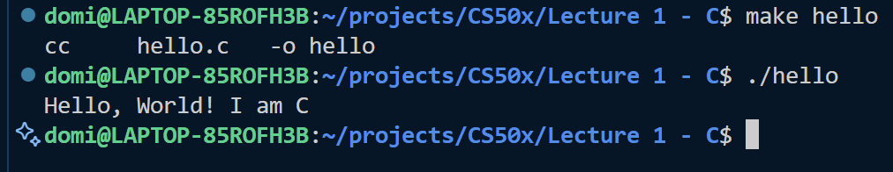

# CS50x
Code notebook for CS50

# Info

For me, it doesn't work on Windows (I don't have a C compiler installed) but it works on Linux (or WSL).

Some commands:
```c
make [program_name] // to compile the source code to machine code
./[program_name] // to run the program
```


# Resources

## Lectures

All lectures are on the YouTube channel here: 
- https://www.youtube.com/cs50/streams (live in 2025)
- https://www.youtube.com/watch?v=h6lqxDwUmJQ&list=PLhQjrBD2T383q7Vn8QnTsVgSvyLpsqL_R&ab_channel=CS50 (the whole course)

## Main website

https://cs50.harvard.edu/x/

## Manuals

- C https://manual.cs50.io/